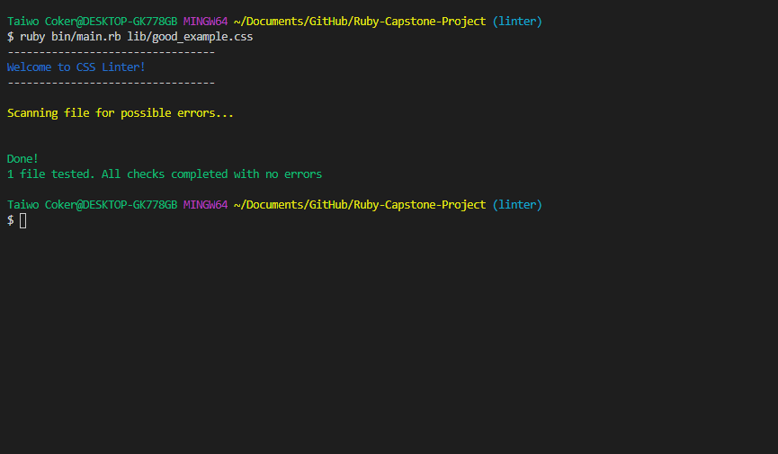
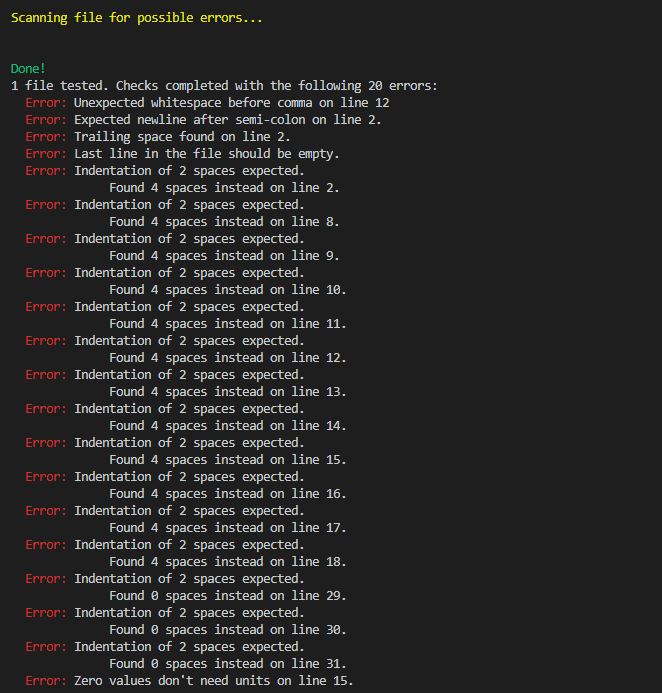

## Ruby-Capstone-Project

This is a CSS lint tool built as a Microverse Ruby capstone project.

## Built With
  Ruby
  Colorize gem
  RSpec
  GitFlow

## Description
  This linter promotes best CSS practices by checking for:

  * Unwanted trailing spaces at the end of lines in a file.
  * Indentation of 2 spaces at the beginning of lines where necessary.
  * Empty line at the end of the file.
  * Spaces after comma.
  * Unexpected white space before comma.
  * Expected newline after semi-colon.
  * Zero values don't need units.

## Live Demo
  Click [here](https://www.loom.com/share/83e4bc18ff7442f7b3f84cee84c0d13e) in order to see a Live Demo of this project.

## Screenshots
# Screenshot of linter passing with no errors

# Screenshot of linter displaying errors

## Getting Started
# Prerequisites
  * Terminal/Command Prompt.
  * CSS stylesheets to run linter on.

## Instructions
# Setup

To get a local copy up and running follow these simple example steps.

  * Download repository files.

  * Open up a terminal session.

  * In your terminal, change directory into the ruby-capstone-project/bin folder.
    ruby bin/main.rb lib/good_example.css or lib/bad_example.css will do the trick! 😉

## Good and Bad Code Examples
# Good Code Example
  Here is an example of good code with correct usage of syntax, spaces and indentation.

.section {
  height: 5rem;
  width: 2rem;
}

# Bad Code Example
 Here is an example of poorly written code with incorrect usage of syntax, spaces and indentation.

.section{
    height: 2rem
  width: 1rem;}

## Author
👤 Taiwo Coker

    Github: @taiwocoker
    Twitter: @SelloCoker
    Linkedin: Taiwo Coker

## 🤝 Contributing
  Contributions, issues and feature requests are welcome!

  Feel free to check the issues page.

## Show your support
  Give a ⭐️ if you like this project!

## Acknowledgments
  Odin Project